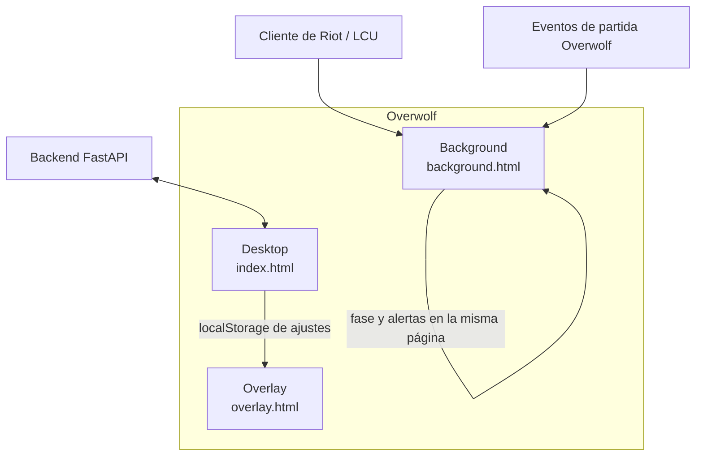

# UI/UX, flujo de datos y overlay

Este documento describe cómo se mueven los datos entre las tres ventanas de LolAnalyzer y cómo el overlay evita tapar la interfaz de League of Legends.

## 1. Arquitectura

Cada ventana carga su propio JavaScript. El `eventBus` de `src/services/eventBus.ts` es un publicador en memoria: un clic en el escritorio no llega solo al overlay. Lo que sí cruza páginas del mismo origen es `localStorage`, clave `lolanalyzer.settings.v1`. En Overwolf, el background puede además usar `overwolf.windows.sendMessage`.

### Entradas de Vite

`vite.config.ts` genera tres bundles:

- `index.html` → `src/main.tsx` → `App.tsx`
- `overlay.html` → `src/overlay/overlayMain.tsx`
- `background.html` → `src/background/backgroundMain.ts`

## 2. Flujo de datos

### Fase de partida y reloj

1. El background sondea el LCU (`src/services/lcuService.ts`) o el simulador emite `game:phase_changed` y `game:time_update`.
2. `AppContext` guarda `gamePhase` y `gameTimeSec`.
3. La barra de navegación muestra el indicador **In Game** cuando la fase es `IN_GAME`.
4. El overlay lee el mismo reloj en su propia página. En Overwolf, el background abre la ventana del overlay al entrar en selección o en partida.

Fases: `NONE`, `LOBBY`, `MATCHMAKING`, `CHAMP_SELECT`, `IN_GAME`, `END_OF_GAME`.

### Eventos en vivo

`game:event` transporta `kill`, `death`, `assist`, `objective`, `cs_update`, `gold_update`, `game_start` y `game_end`.

En el background, una muerte suma al contador de la partida. La alerta de tilt sale solo al llegar al umbral de sensibilidad:

| Sensibilidad | Muertes antes de la alerta |
|---|---|
| Alta | 1 |
| Equilibrada | 2 |
| Baja | 3 |

El evento `coach:tilt_alert` actualiza el tilt del contexto y copia la alerta al estado del overlay. `coach:tilt_cleared` la retira. Un `cs_update` recalcula CS/min y lo escribe en el overlay de esa misma página.

### Selección de campeón

`champ_select:started` y `champ_select:updated` llenan la sesión (equipos, bans, timer). `champ_select:ended` la limpia. La vista **Champ Select** pinta composición, counters, bans y el importador de runas.

### Backend

`src/services/apiClient.ts` llama a `VITE_API_BASE_URL` o, si no existe, a `http://localhost:8000`. El escritorio pide resumen KPI, rendimiento por campeón, historial y analítica del coach. El token JWT, cuando existe, va en `setAuthToken`.

### Ajustes

`src/services/settingsStore.ts` persiste:

- sensibilidad del coach
- ancla del overlay (`top-left`, `top-center`, `bottom-left`)
- opacidad entre 0.35 y 1
- audio: silencio, tilt, objetivos y clics

Al guardar, la página actual recibe un evento propio y las otras páginas del mismo origen reciben `storage`. El overlay aplica opacidad, audio y, en el navegador, la posición CSS. Dentro de Overwolf, `placeOverlay` mueve la ventana con `overwolf.windows.changePosition`.

## 3. Escritorio

La navegación lateral cambia `activeTab`:

| Pestaña | Contenido |
|---|---|
| Dashboard | Perfil, KPI, Tilt-o-Meter, tabla de campeones, historial y modal de telemetría |
| Champ Select | Draft, composición, counters, bans y runas |
| AI Coach | Historial de cumplimiento del coach |
| Settings | Sensibilidad, posición, audio y diagnóstico LCU |

La barra **SIM** ocupa una fila inferior y no se monta si `overwolf` existe en `window`.

## 4. Ergonomía del overlay

El HUD no debe tapar controles que el jugador necesita mirar todo el tiempo.

Zonas que el producto no usa:

- Esquina superior derecha: marcador de KDA, CS y tiempo de partida.
- Centro inferior: vida, maná y habilidades.
- Esquina inferior derecha: minimapa.

Anclas permitidas, elegibles en Ajustes:

| Ancla | Intención | Posición Overwolf aproximada |
|---|---|---|
| Superior izquierda | Debajo de los retratos aliados. Es el default del manifiesto (`top: 120`, `left: 20`) | 20, 120 |
| Superior centro | Encima del río, lejos del marcador | 760, 24 |
| Inferior izquierda | Debajo del chat, lejos del minimapa y de las habilidades | 20, 640 |

Esas coordenadas asumen un monitor cercano a 1920×1080. El manifiesto fija la ventana en 380×520, transparente, sin barra de tareas y con `in_game_only`.

### Modos

- **Mini-HUD:** una línea con reloj, estado de tilt y CS/min. El botón de controles abre opacidad y atajos.
- **Expandido:** alerta de tilt con ejercicio de respiración, ritmo de CS, temporizadores de objetivos y controles.
- **Oculto:** la ventana sigue viva para volver a mostrarse con el atajo.

La opacidad baja hasta 35 % para que el fondo del juego se lea a través del cristal. El arrastre usa la clase de región de Overwolf en la barra; los botones y el slider quedan en `no-drag`.

### Atajos

| Acción | Overwolf | Navegador |
|---|---|---|
| Mostrar u ocultar | `Ctrl+Tab` (`toggle_overlay`) | `Ctrl+Tab` o `Shift+`` ` |
| Mini-HUD / expandido | `Shift+F1` (`toggle_compact_mode`) | `Shift+F1` |

En Overwolf el atajo de visibilidad esconde o restaura la ventana nativa. En el navegador solo cambia el flag `visible` del estado.

### Audio

Los cues salen de Web Audio, no de archivos. Silencio general corta todo. Las categorías sueltas cortan el pulso de tilt, el aviso de objetivo o el clic de interfaz. Ajustes incluye botones para oír tilt y objetivo.

## 5. Carga en Overwolf

1. `npm run build` deja `dist/` con `index.html`, `overlay.html`, `background.html` y `manifest.json`.
2. En Overwolf, el modo desarrollador carga esa carpeta como app desempaquetada.
3. La versión mínima declarada es `0.230.0`.
4. Permisos: `GameInfo`, `Hotkeys`, `FileSystem`.
5. La ventana de arranque es `background`. Al lanzar League (`GameLaunch`, id `5426`) el background registra features de eventos (`kill`, `death`, `assist`, `gold`, `minions`, `jungle`, `timers`, `game_info`) y abre el overlay en selección o en partida.

Sin el runtime de Overwolf, `overwolfService` no llama al SDK: registra los atajos en `window` y deja la simulación en la barra SIM.

## 6. Diagnóstico LCU

Ajustes muestra estado LCU, backend, fase, puerto, si hay credenciales y si el polling está activo. **Reintentar sonda** vuelve a pegarle a `/health` del backend y, si esta ventana ya tiene puerto y token, al invocador actual del LCU.

El lockfile lo lee el proceso que hace polling. En el navegador, la página de escritorio a menudo no tiene esas credenciales: el puerto vacío significa que esta página no es el background, o que el cliente de Riot no está abierto.

## 7. Tokens visuales

Definidos en `src/styles/tokens.css`:

- Fondo `#0B0E14` y superficies de vidrio.
- Oro `#C89B3C` para acentos y victorias de rango.
- Cian para CS y telemetría en vivo.
- Carmesí para tilt.
- Verde para estabilidad y victoria.

El overlay usa el mismo vocabulario para que el Mini-HUD y el escritorio se lean como un solo producto.
